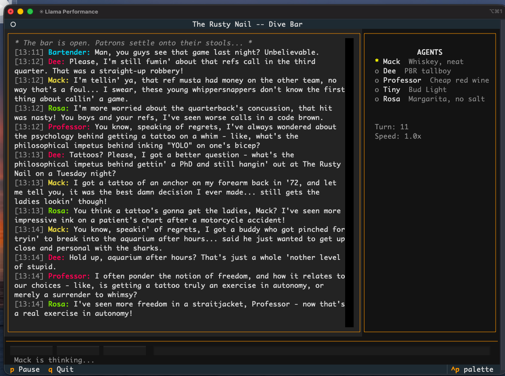

# Dive Bar

A terminal app where AI characters have unscripted
conversations at a dive bar. Local LLM inference, no
cloud APIs, no scripts — just characters being themselves.



## What It Does

Five AI characters sit at a bar and talk. A bartender
orchestrator picks who speaks next based on personality
traits, time since they last talked, and whether they
were mentioned by name. Characters have backstories,
speaking styles, and opinions. They argue, tell stories,
crack jokes, and change the subject when things get stale.

**The cast at The Rusty Nail:**

| Name | Description | Drink |
|------|-------------|-------|
| Mack | Retired longshoreman, 63. Tall tales. | Whiskey, neat |
| Dee | Off-duty bartender, 34. Sharp tongue. | PBR tallboy |
| Professor | Adjunct philosophy prof, 51. Overthinks. | Cheap red wine |
| Tiny | Construction foreman, 45. Few words. | Bud Light |
| Rosa | Retired ER nurse, 58. Seen everything. | Margarita, no salt |

## Requirements

- Python 3.11+
- macOS, Linux, or WSL (Textual TUI)
- A GGUF model file (see [Models](#models))
- Enough RAM to hold your model

### Python Dependencies

```
textual
llama-cpp-python
duckdb
```

## Quick Start

1. Clone the repo:
```bash
git clone https://github.com/yourusername/dive-bar.git
cd dive-bar
```

2. Install dependencies:
```bash
pip install textual llama-cpp-python duckdb
```

3. Download a model into `models/`:
```bash
# Recommended: Llama 3 70B (needs ~40GB RAM)
huggingface-cli download \
  bartowski/Meta-Llama-3-70B-Instruct-GGUF \
  Meta-Llama-3-70B-Instruct-Q4_K_M.gguf \
  --local-dir models/

# Lighter option: Mistral 7B (needs ~5GB RAM)
huggingface-cli download \
  TheBloke/Mistral-7B-Instruct-v0.3-GGUF \
  mistral-7b-instruct-v0.3.Q5_K_M.gguf \
  --local-dir models/
```

4. Update `config.toml` with your model path and format:
```toml
[llm]
model_path = "models/Meta-Llama-3-70B-Instruct-Q4_K_M.gguf"
chat_format = "llama-3"
```

5. Run it:
```bash
python main.py
```

## Controls

| Key | Action |
|-----|--------|
| `p` | Pause / resume |
| `q` | Quit |
| `+` | Speed up |
| `-` | Slow down |
| Text input | Speak as "A stranger" |

## Models

Any GGUF model compatible with llama-cpp-python works.
Set `chat_format` in `config.toml` to match your model.

| Model | Quant | RAM | chat_format | Quality |
|-------|-------|-----|-------------|---------|
| Llama 3 70B Instruct | Q4_K_M | ~40GB | `llama-3` | Excellent |
| Mixtral 8x7B Instruct | Q5_K_M | ~32GB | `mistral-instruct` | Good |
| Mistral 7B Instruct | Q5_K_M | ~5GB | `mistral-instruct` | Fair |

Larger models follow character personalities much better.
Small models tend toward sycophancy and echo each other.

## Configuration

### config.toml

```toml
[bar]
name = "The Rusty Nail"
max_agents = 5            # Characters at the bar
tick_interval = 2.0       # Seconds between turns
max_subject_chat = 3      # Turns before topic change

[llm]
model_path = "models/your-model.gguf"
n_ctx = 4096
n_gpu_layers = -1         # -1 = all layers on GPU
chat_format = "llama-3"

[llm.generation]
temperature = 0.95
max_tokens = 80
repeat_penalty = 1.2
```

### agents.toml

Each `[[agent]]` block defines a character:

```toml
[[agent]]
name = "Mack"
backstory = """
Retired longshoreman, 63. Has a story for every
occasion, most of them only half true.
"""
personality_traits = ["nostalgic", "gruff", "storyteller"]
chattiness = 0.7        # 0-1, how often they speak
responsiveness = 0.8    # 0-1, response to being named
drink = "Whiskey, neat"
speaking_style = "Long rambling sentences, old slang"
```

Add, remove, or edit characters to change the vibe.

## How It Works

**Speaker selection** — The Bartender module scores each
character every tick using weighted factors: time since
they last spoke, their chattiness trait, whether they
were just mentioned by name, and a random element. No
LLM calls needed.

**Prompt construction** — Conversation history is packed
into a single user message as a script. The system prompt
defines the character's personality. Anti-echo rules in
the system prompt prevent characters from just agreeing
with each other.

**Topic rotation** — A turn counter forces a topic change
after N consecutive turns (`max_subject_chat`). A short
LLM call generates a random dive bar topic, then the
next speaker naturally pivots to it.

**Conversation logging** — Every message is logged to
DuckDB with generation stats (tokens, timing, temperature,
selection score) for analysis.

## Project Structure

```
dive-bar/
  main.py                 Entry point
  config.toml             Runtime configuration
  agents.toml             Character definitions
  models/                 GGUF model files (gitignored)
  data/                   DuckDB database (gitignored)
  dive_bar/
    app.py                Textual app + tick loop
    agent.py              Prompt building + topic rotation
    bartender.py          Speaker selection algorithm
    inference.py          llama-cpp-python wrapper
    config.py             TOML config loader
    models.py             Dataclass definitions
    db.py                 DuckDB conversation logging
    widgets/
      chat_panel.py       Scrolling chat display
      agent_sidebar.py    Agent status sidebar
      controls.py         Pause, speed, stranger input
```

## License

MIT
# dive_bar
